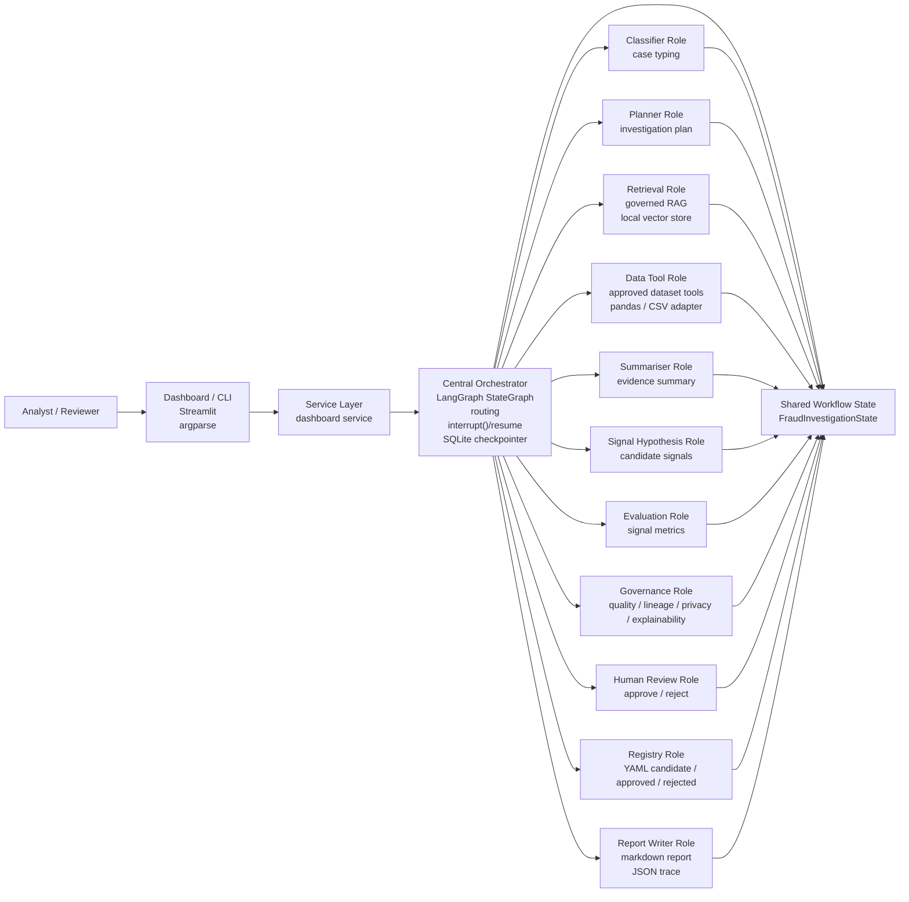

```mermaid
flowchart LR
    U["Analyst / Reviewer"]

    UI["Dashboard / CLI
    Streamlit
    argparse"]

    SVC["Service Layer
    dashboard service"]

    ORCH["Central Orchestrator
    LangGraph StateGraph
    routing
    interrupt()/resume
    SQLite checkpointer"]

    STATE["Shared Workflow State
    FraudInvestigationState"]

    C["Classifier Role
    case typing"]

    P["Planner Role
    investigation plan"]

    R["Retrieval Role
    governed RAG
    local vector store"]

    D["Data Tool Role
    approved dataset tools
    pandas / CSV adapter"]

    S["Summariser Role
    evidence summary"]

    H["Signal Hypothesis Role
    candidate signals"]

    E["Evaluation Role
    signal metrics"]

    G["Governance Role
    quality / lineage / privacy / explainability"]

    HR["Human Review Role
    approve / reject"]

    REG["Registry Role
    YAML candidate / approved / rejected"]

    REP["Report Writer Role
    markdown report
    JSON trace"]

    U --> UI --> SVC --> ORCH
    ORCH --> STATE

    ORCH --> C
    ORCH --> P
    ORCH --> R
    ORCH --> D
    ORCH --> S
    ORCH --> H
    ORCH --> E
    ORCH --> G
    ORCH --> HR
    ORCH --> REG
    ORCH --> REP

    C --> STATE
    P --> STATE
    R --> STATE
    D --> STATE
    S --> STATE
    H --> STATE
    E --> STATE
    G --> STATE
    HR --> STATE
    REG --> STATE
    REP --> STATE

```
